# Database-Normalization-and-Postgres-Installation

Slide Link: https://drive.google.com/file/d/1Sp_11zUXL8u6lKK7cJ4s4an8cjJ-JNU7/view?usp=sharing

In this module, we will explore data anomalies and the different types of anomalies in DBMS.

You’ll learn normalization step by step – from 1NF to 3NF – with clear examples.

We will also cover resolving many-to-many relationships and updating ER diagrams using junction tables.

Finally, we’ll introduce PostgreSQL, set it up, and practice essential commands using the psql CLI.

## 43-1 Data Anomalies and Types of Anomalies in DBMS

### Anomalies 
- Imbalance in database is called anomalies 
- Anomalies in databases refer to inconsistencies or unexpected issues that can occur during data manipulation or retrieval

#### Types Of Anomalies 
- Update Anomalies 
- Delete Anomalies 
- Insert Anomalies 

##### Update Anomalies 

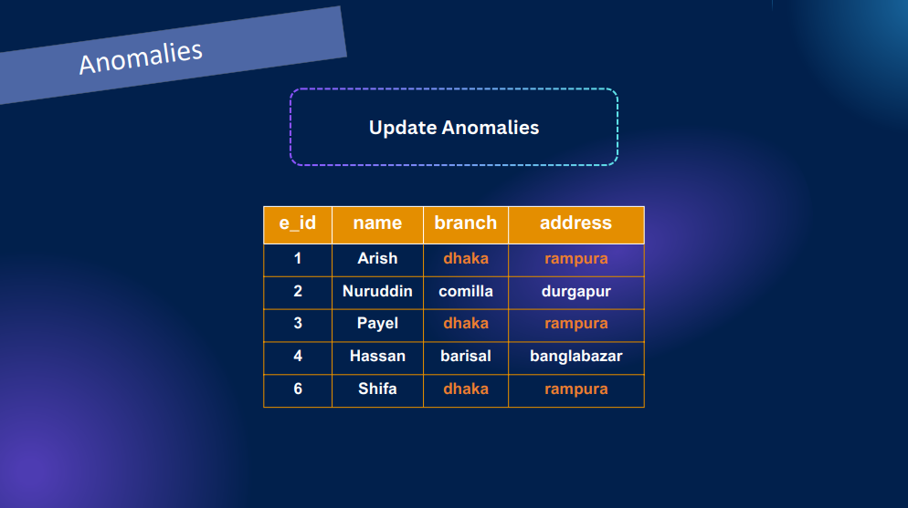

- Here Branch Dhaka and address Rampura came multiple times which is data duplication. suppose the branch name changes to Khilgao we have to update each Dhaka manually
- If there is data duplications in a table we will say there is any of the anomalies  

##### Delete Anomalies

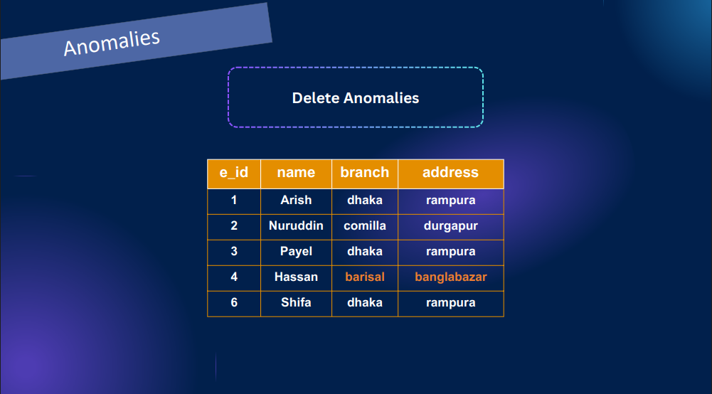

- Hassan works in barisal bagher bazar. If we delete hasan barisal branch information will be gone This is called delete anomalies 

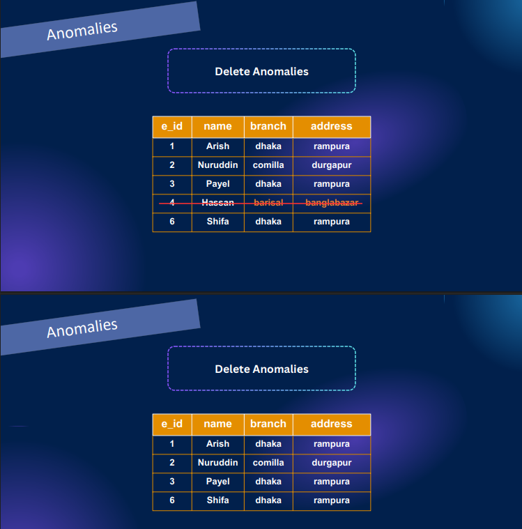

##### Insert Anomalies 

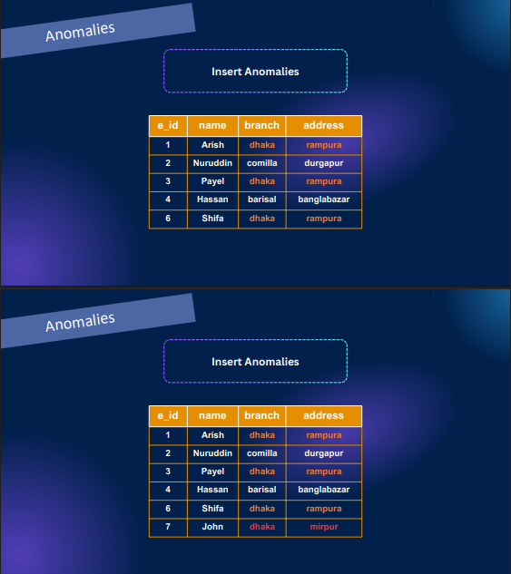

- Suppose new person came and we have gave wrong address. Dhaka branch address will be different. we need some validations like it should be Rampura.

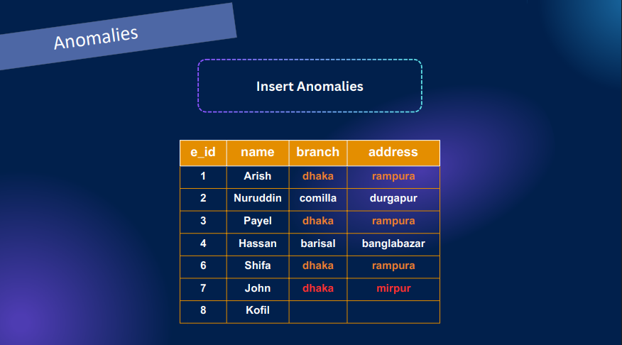

- Suppose we have not allocated address and branch. thi will create null. Keeping null resembles anomalies. 

- How do we fix this?
- We could separate and make a relationship for avoiding anomalies  

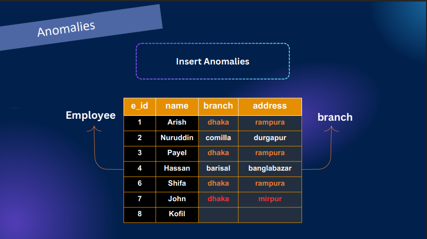

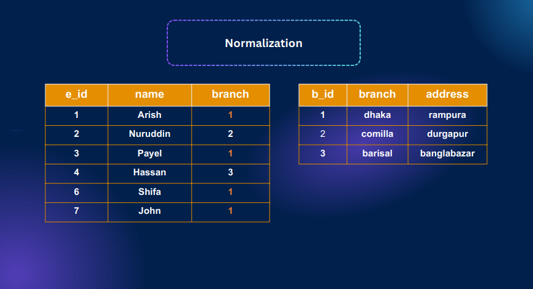

- This kind of table separations are called Normalizations 

## 43-2 Normalization and Functional Dependency
- Normalization is a step by step process by using which we can remove any anomalies in our database 

### Functional Dependency  
- Functional dependency in simple terms means that the value of one attribute (or set of attributes) uniquely determines the value of another attribute(s) in a table.

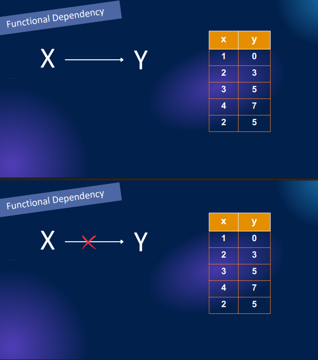

- Here for x value 2 we have two different y value. So this is why its not functionally dependent.

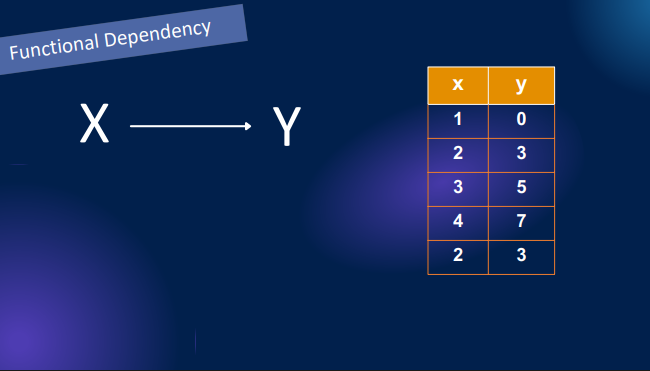

- if we consider x and tell to find y value using x we can find easily and this is functionally dependent. Here Y is functionally dependent to x 

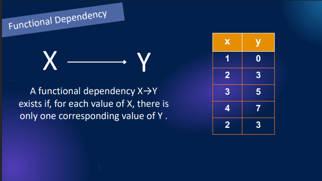

#### lets see another example 

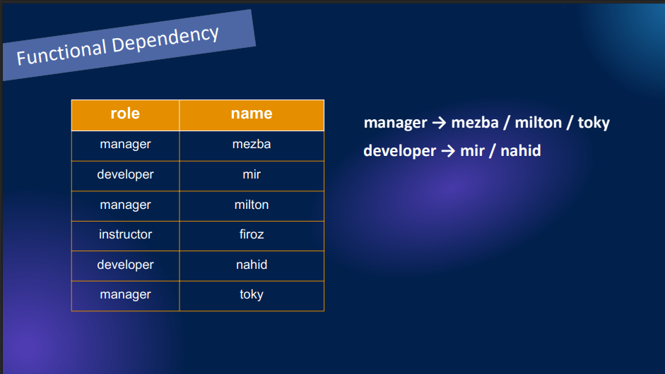

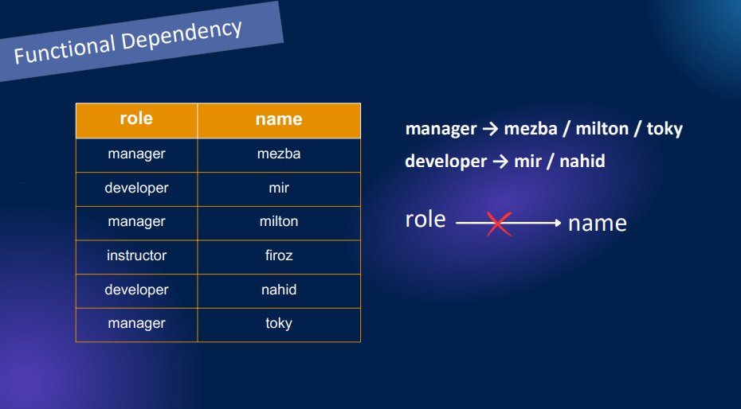

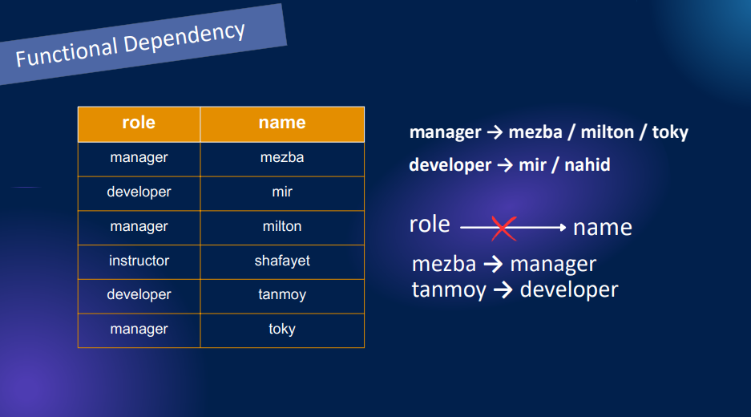

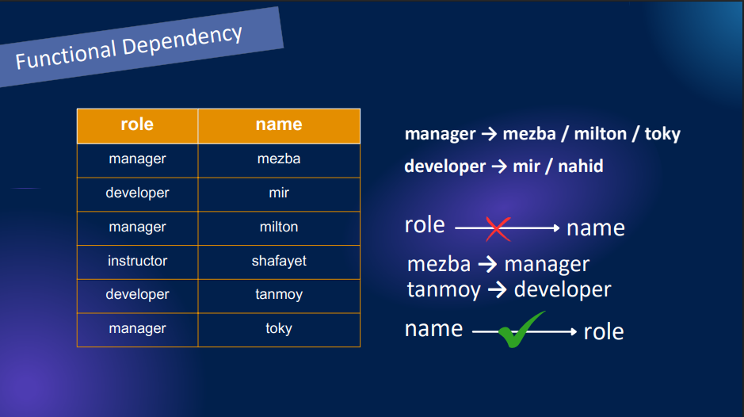

- here role can not determine the name. but the role can determine the role. This is called functional dependency 

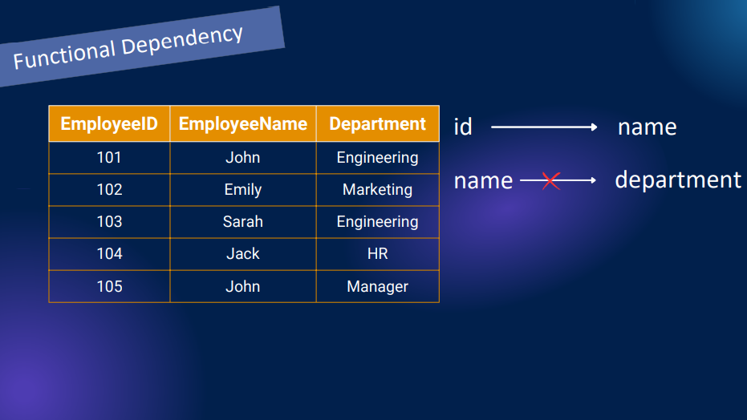

- another example 

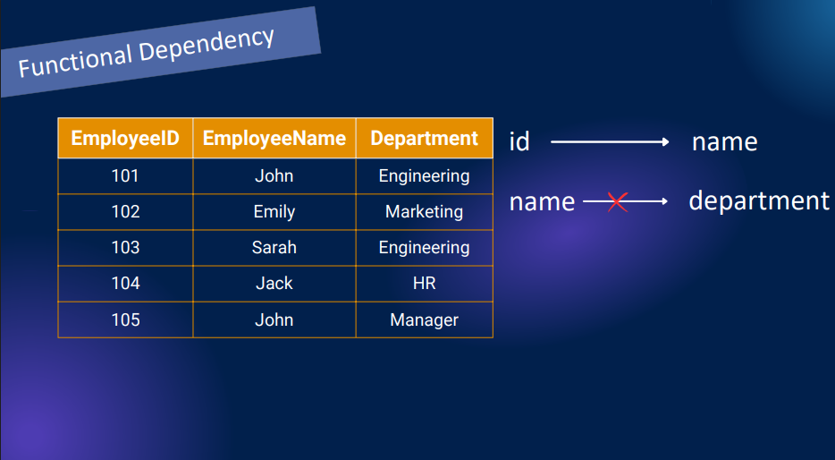

## 43-3 1NF Explained | First Normal Form with Easy Example

### Normal Forms

- A set of rules applied to a database table to reduce redundancy and avoid anomalies in data by organizing it properly

### Type of normal forms
- 0NF
- 1NF
- 2NF
- 3NF 

####